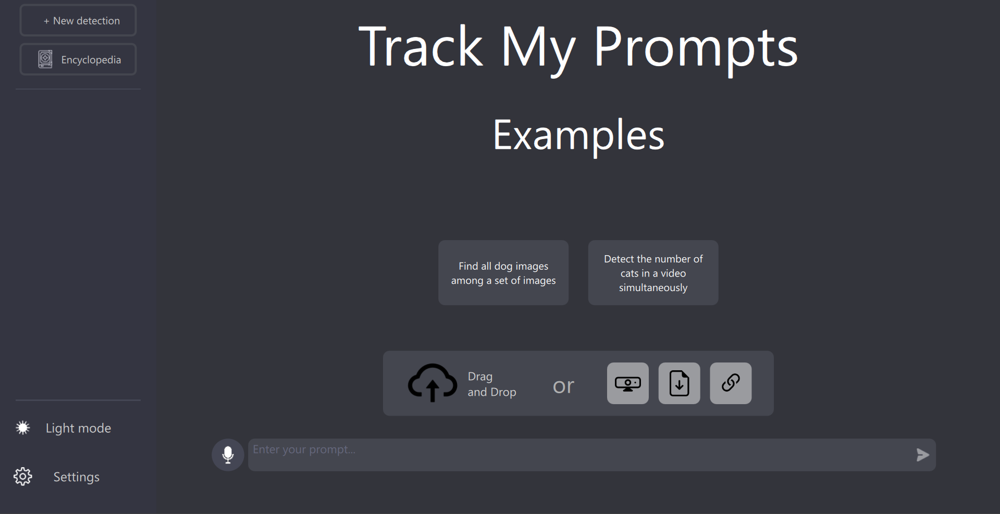

# Track My Prompts

L'application Track My Prompts permet d'utiliser un modèle d'intelligence artificielle de reconnaisance d'images. Elle permet de détecter des objets du quotidien et interprète des prompts pour une recherche plus ciblée.

## Fonctionnalités 

- Détection d'objets dans des images et des vidéos
- Détection en direct à travers la webcam
- Interprétation de prompts pour une détection plus ciblée
- ...